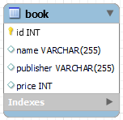

# 도서 관리 시스템
* **JPA**: 객체와 데이터베이스간의 매핑을 자동화하는 방식입니다. 개발자가 SQL를 직접 작성하지 않고도 객체를 사용하여 CRUD작업을 수행할 수 있습니다.
- JPA를 사용하면 개발자가 직접 SQL을 작성하지 않아도 되므로 개발 과정이 단순화되고 생산성이 향상됩니다. 하지만 성능 최적화나 복잡한 쿼리를 작성하는 데 어려움이 있을 수 있습니다.
* **Spring Data JPA**: JPA 상단에 레이어를 추가하여, 저장소 패턴의 코드 없음 구현 및 메서드 이름에서 데이터베이스 쿼리 생성과 같은 자체 기능을 추가합니다.
- Spring Data JPA는 JPA를 더욱 쉽게 사용할 수 있도록 도와주는 도구입니다. 기본적인 CRUD 연산을 위한 메소드를 제공하므로 개발자가 이를 직접 구현할 필요가 없습니다. 하지만 복잡한 쿼리를 작성하거나 성능을 최적화하는 데는 한계가 있을 수 있습니다.
* **MyBatis**: 개발자가 직접 SQL 쿼리를 작성하고 매핑하는 방식입니다. 세밀한 제어가 가능하며, 복잡한 쿼리나 성능 튜닝이 필요한 경우 유용합니다.
-  MyBatis를 사용하면 SQL 쿼리를 직접 작성할 수 있으므로, 세밀한 쿼리 최적화가 가능합니다. 하지만 SQL을 직접 작성해야 하므로 개발 과정이 복잡해질 수 있습니다.

# 애플리케이션 계층 구조

# ERD

